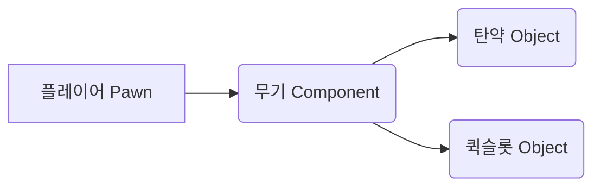
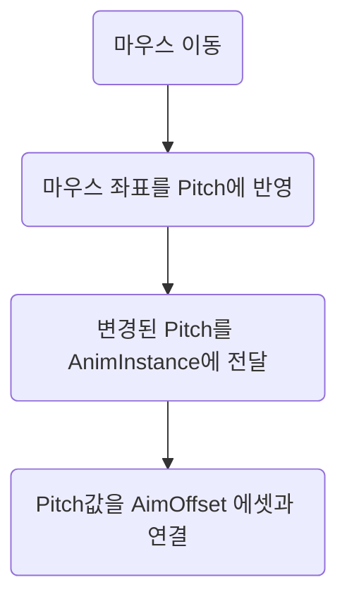
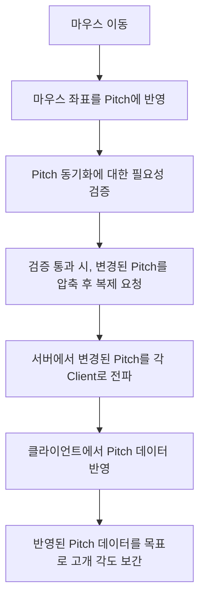

# 프로젝트 개요
- 장르: 멀티플레이 대전 FPS
- 개발 기간
25.03.01 ~ 25.05.04 (약 2개월)
- 사용 엔진 / 툴   
언리얼 엔진 5.4(C++)   
언리얼 멀티플레이 프레임워크 (리슨 서버)   
AdvancedSteamSession   
DALL`E AI이미지 생성 도구   

   
클릭시 유튜브 영상으로 연결됩니다.    
   
https://docs.google.com/presentation/d/1K4wmkCus3aIKurOz7L-LkOHfS_GwfT8n/edit?usp=sharing&ouid=108392341294580987480&rtpof=true&sd=true   
프로젝트에 대한 프레젠테이션 파일입니다.   

# 프로젝트 구조
안녕하세요. 게임 개발자 지망생 김현기입니다. 제 첫 프로젝트를 소개하게 되어 매우 기쁩니다. 

이번 프로젝트는 언리얼 멀티플레이 프레임워크 리슨 서버 기능을 활용해 제작된 멀티플레이 대전 FPS입니다.
프로젝트에 포함된 클래스 구조는 철저히 컴포넌트 패턴으로 제작되어 있고, 컴포넌트 클래스의 복잡성을 줄이기 위해 일부 로직을 UObject 기반 클래스로 분리하려는 시도도 추가되었습니다. 
> 구조 예시

# 주요 기능
게임은 리슨 서버 환경에서 진행되기에, 패킷 교환 시 교환 빈도와 패킷 크기를 최대한 줄이기 위해 노력했습니다.    
아래는 그 노력의 일환입니다.

### AimOffset 최적화
`"플레이어의 캐릭터가 플레이어의 마우스 입력을 받아 고개를 위아래로 움직이는 기능"`   
위 기능을 구현하기 위한 방법이 여러 있을 수 있겠지만, 일반적으로 아래와 같은 구현 과정을 거칠 것으로 예상됩니다.
>일반적인 구현

다만 이 방식은 플레이어가 마우스에서 손을 떼지 않는 한 **매 프레임** 호출되며,  Pitch 데이터가 4바이트 float으로 비교적 **큰 데이터**를 전달해야 합니다. 즉, 멀티플레이 구조에서 구현 시 60프레임 기준 1초에 **60회 호출, 최소 240바이트** 패킷 교환이 발생합니다. 이러한 패킷은 플레이어 수에 비례하여 지속적으로 발생하기에 최적화가 필요하였고, 이에 아래와 같이 개선하였습니다.
>개선된 구현

개선된 구현의 주요 차별점은 우선 클라이언트가 플레이어의 고개 각도가 충분히 벌어졌는지, 마지막 동기화로부터 0.1초 이상 시간이 지났는지 확인, 즉 사소한 움직임은 제외하고 동기화 요청을 0.1초에 한 번만 수행하도록 개선하였고, 0.1초에 한번 동기화 된 데이터를 목표로 클라이언트에서 고개 각도를 보간 움직임을 수행하는 과정을 거친다는 점입니다.
개선 이후 패킷은 아래와 같이 최적화 됩니다.
|60프레임 기준 |기존 구현   |개선된 구현  |
|-------------|-----------|-----------|
|빈도         |1초 간 60회 |1초 간 10회 |
|크기         |최소 240byte|최소 10byte|
### 무기 데이터 교환
유저가 게임을 실행할 때, 유저의 게임 인스턴스에서는 무기 데이터를 미리 로드합니다. 주로 무기의 3D Mesh, 머즐 이펙트, 총기 사운드 등, 게임 경험과 관련된 데이터를 로드합니다. 서버가 초기화 될 때에도 무기 데이터가 로드됩니다. 서버에서 로드하는 데이터는 데미지, 발사 속도, 총기 타입 등의 값과 관련된 데이터를 로드합니다.
||타깃 데이터|예시|
|-|-|-|
|서버|Value 위주|데미지, 발사속도, 타입, 반동, 총알 수 등|
|클라이언트|Effect 위주|무기 Mesh, 무기 아이콘, 머즐 이펙트, 총기 사운드|   
무기에 대한 판정과 데이터 반영은 서버에서 진행됩니다.   
클라이언트는 서버에서 반영된 데이터를 시각적으로 표현하는 역할만 수행합니다.   
이 때, "반영된 데이터" 의 확인은 1byte 크기의 무기ID 데이터를 교환하는 것으로 이루어집니다.   
클라이언트는 서버에서 전달받은 무기ID를 바탕으로 미리 로드한 데이터에서 무기 Mesh, 발사 이펙트 등의 시각 데이터를 가져옵니다. 서버는 클라이언트가 무기 교체 시 전달한 무기ID를 바탕으로 플레이어의 데미지와 발사 속도 등을 설정합니다. 이렇게 최소한의 패킷 교환으로, 무기에 대한 각종 이벤트 구현이 가능해집니다.
### 발소리 재생
언리얼 프레임워크에서 플레이어의 움직임은 자동으로 리플리케이트 됩니다.
